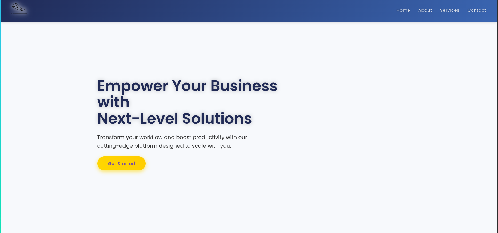
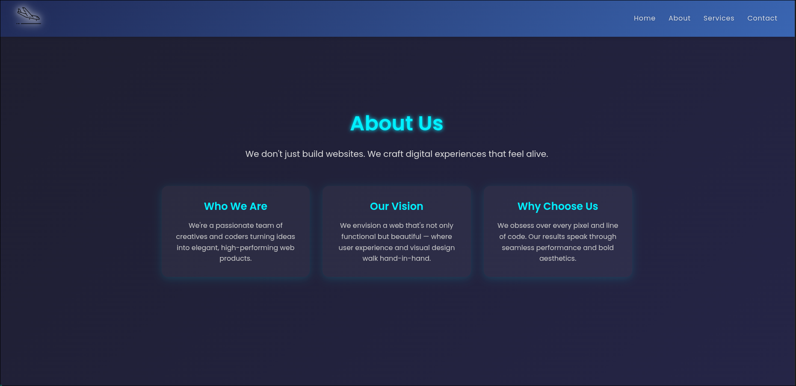
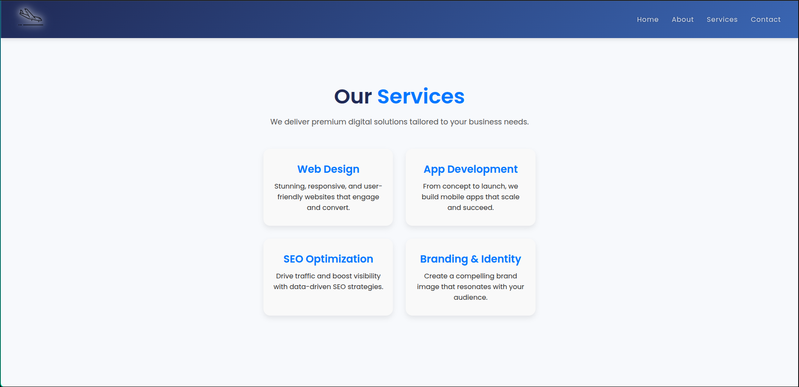
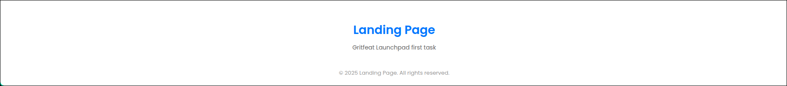

# Landing Page

A stylish, responsive landing page with a sleek navbar, home, about, services, contact sections, and a footer.  
Built with semantic HTML and modern CSS animations for a polished user experience.

---

## Features

- **Responsive Navigation Bar** with hamburger menu for mobile devices
- **Smooth fade-in animation** on main sections
- Well-structured semantic sections: Home, About, Services, Contact, Footer
- Fully responsive layout for desktop and mobile

---

## Technologies Used

- HTML5  
- CSS3 (Flexbox, Grid, Animations)  
- Google Fonts (Poppins)  

---

## Glimps of Landing page

* Home Page

* About Page 

* Service Page

* Contact Page 

* Footer 

