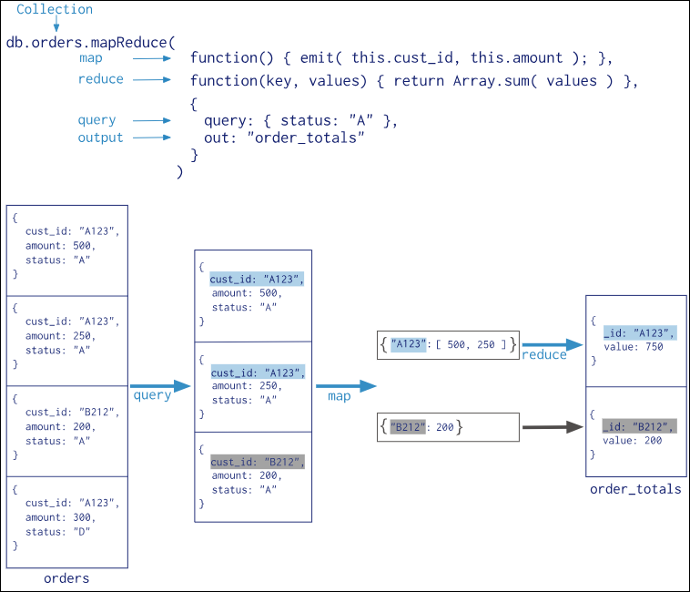

# Calculate Total Stock Value by Category.

Query

```
db.products.aggregate([{$group : {_id : "$category" , total_share : {$sum : "$stock"}, share_value : {$sum : {$multiply : ["$stock" , "$price"]}}}}])
```

Output 

```
[
  { _id: 'Keyboard', total_share: 8, share_value: 6392 },
  { _id: 'Percussion', total_share: 5, share_value: 6002.5 },
  { _id: 'String', total_share: 55, share_value: 15699.55 }
]
```

# Count Products per Brand.

Query 

```
db.products.aggregate([{$group : {_id : "$brand", count : {$sum : "$_id"}}}])
```

Output 

```
[
  { _id: 'BassPro', count: 1 },
  { _id: 'AlohaTune', count: 1 },
  { _id: 'KeyMaster', count: 1 },
  { _id: 'GuitarCo', count: 1 },
  { _id: 'BeatKing', count: 1 }
]
```

# Find the Average Rating for Each Product.

Query 

```
db.products.aggregate([{$unwind : "$reviews"}, {$group : {_id : "$_id" , average_rating : {$avg : "$reviews.rating"}}}])
```

Output 

```
[
  { _id: 'PROD002', average_rating: 5 },
  { _id: 'PROD004', average_rating: 4 },
  { _id: 'PROD006', average_rating: 4 },
  { _id: 'PROD001', average_rating: 4.5 }
]
```

# Calculate Total Sales for Each Product.

Query 

```
db.orders.aggregate([{$unwind : "$items"} , {$group : {_id : "$items.product_id" , count : {$sum : 1}}}])
```

Output 

```
[
  { _id: 'PROD002', count: 1 },
  { _id: 'PROD004', count: 1 },
  { _id: 'PROD005', count: 1 },
  { _id: 'PROD003', count: 1 },
  { _id: 'PROD001', count: 2 }
]
```

# Recalculate each order's total amount using $reduce.

Query 

```
db.orders.aggregate([{$project : {_id : 1 , total_amount : {$reduce : {input : "$items" , initialValue : 0 , in : {$add : ["$$value" , {$multiply : ["$$this.quantity" , "$$this.unit_price"]}]}}}}}])
```

Output 

```
[
  { _id: 'ORDER001', total_amount: 679.97 },
  { _id: 'ORDER002', total_amount: 799 },
  { _id: 'ORDER003', total_amount: 499.99 },
  { _id: 'ORDER004', total_amount: 1200.5 },
  { _id: 'ORDER005', total_amount: 550 }
]
```

# Find the total quantity of 'String' products sold.

Query 

```
db.orders.aggregate([
    {$unwind : "$items"} ,
    {$lookup : {from : "products" , localField : "items.product_id" , foreignField : "_id", as : "product_detail"}}, {$unwind : "$product_detail"} ,
    {$group : {_id : "$_id", total : {$sum : 1}}}])
```

Output 

```
[
  { _id: 'ORDER003', total: 1 },
  { _id: 'ORDER001', total: 2 },
  { _id: 'ORDER002', total: 1 },
  { _id: 'ORDER004', total: 1 },
  { _id: 'ORDER005', total: 1 }
]
```


# Find the average rating for each product that has received at least one review. 

Query 

```
db.products.aggregate([{$unwind : "$reviews"} , {$group : {_id : "$_id" , average_rating : {$avg : "$reviews.rating"}}}])
```

Output 

```
[
  { _id: 'PROD001', average_rating: 4.5 },
  { _id: 'PROD002', average_rating: 5 },
  { _id: 'PROD004', average_rating: 4 },
  { _id: 'PROD006', average_rating: 4 }
]
```

# For each product, create a summary that includes its name and price, a simple list of the usernames who reviewed it, and a list of the order IDs in which it was sold.

Query 

```

```

# Retrieve a list of all orders, but instead of just showing product IDs in the items array, replace them with a more detailed object containing the product's name, brand, and category.

Query 

```
db.orders.aggregate([
    {$lookup : {from : "products" , localField : "items.product_id" , foreignField : "_id", as : "product_detail"}},
    {$project : { customer_id : 1 , order_date : 1, status : 1, total_amount : 1, product_detail : {$map : {input : "$product_detail", as : "p", in : ["$$p.name", "$$p.brand" , "p.category"]}}}}
])
```

Output 

```
[
  {
    _id: 'ORDER001',
    customer_id: 'CUST001',
    order_date: ISODate('2023-01-10T10:00:00.000Z'),
    status: 'completed',
    total_amount: 679.97,
    product_detail: [
      [ 'Acoustic Guitar', 'GuitarCo', 'p.category' ],
      [ 'Ukulele', 'AlohaTune', 'p.category' ]
    ]
  },
  {
    _id: 'ORDER002',
    customer_id: 'CUST002',
    order_date: ISODate('2023-01-15T14:30:00.000Z'),
    status: 'pending',
    total_amount: 799,
    product_detail: [ [ 'Electric Piano', 'KeyMaster', 'p.category' ] ]
  },
  {
    _id: 'ORDER003',
    customer_id: 'CUST001',
    order_date: ISODate('2023-02-01T09:00:00.000Z'),
    status: 'completed',
    total_amount: 499.99,
    product_detail: [ [ 'Acoustic Guitar', 'GuitarCo', 'p.category' ] ]
  },
  {
    _id: 'ORDER004',
    customer_id: 'CUST003',
    order_date: ISODate('2023-02-05T11:45:00.000Z'),
    status: 'completed',
    total_amount: 1200.5,
    product_detail: [ [ 'Drum Kit', 'BeatKing', 'p.category' ] ]
  },
  {
    _id: 'ORDER005',
    customer_id: 'CUST002',
    order_date: ISODate('2023-03-01T16:00:00.000Z'),
    status: 'pending',
    total_amount: 550,
    product_detail: [ [ 'Bass Guitar', 'BassPro', 'p.category' ] ]
  }
]
```

# Create a profile for each customer showing a list of products they have purchased. The list should not contain duplicates and should include the product name and category.

Query 

```
db.orders.aggregate([
  { $unwind: "$items" },
  {
    $lookup: {
      from: "products",
      localField: "items.product_id",
      foreignField: "_id",
      as: "product_detail"
    }
  },
  { $unwind: "$product_detail" },
  {
    $group: {
      _id: "$customer_id",
      items: {
        $addToSet: {
          name: "$product_detail.name",
          category: "$product_detail.category"
        }
      }
    }
  }
])
```

Output

```
[
  {
    _id: 'CUST002',
    items: [
      { name: 'Bass Guitar', category: 'String' },
      { name: 'Electric Piano', category: 'Keyboard' }
    ]
  },
  {
    _id: 'CUST003',
    items: [ { name: 'Drum Kit', category: 'Percussion' } ]
  },
  {
    _id: 'CUST001',
    items: [
      { name: 'Ukulele', category: 'String' },
      { name: 'Acoustic Guitar', category: 'String' }
    ]
  }
]
```

# Map-Reduce 

Map-reduce is a data processing paradigm for condensing large volumes of data into useful aggregated results. To perform map-reduce operations, MongoDB provides the mapReduce database command.

* Operates on documents of a single collection.
* Can filter, sort, or limit documents before the map stage.



## Phases of Map-Reduce 

* Map Phase

  * A JavaScript function applied to each document.
  * Emits key-value pairs.
  * Can emit multiple or no key-value pairs per document.

* Reduce Phase

  * Applied to keys with multiple values.
  * Collects and condenses these values into a single object per key.

* Finalize Phase

  * Further processes or transforms the reduced results.
  * Useful for additional calculations or formatting.


**Syntax**

```
db.orders.mapReduce(
  mapFunction,
  reduceFunction,
  { query: { condition, } }
)
```

**Example** 

```
db.orders.mapReduce(
  function() { 
    emit(this.category, this.price); 
  },
  function(key, values) { 
    return Array.sum(values); 
  },
  {
    out: { inline: 1 }    // or
    <!-- out : "output_collection" -->
  }
)
```

## Input-Output Model 

* Input Stage 

  * The input to a map-reduce operation is the set of documents in a single collection.
  * Can filter the documents using a query before processing, e.g., only documents where category: "Electronics".

* Output Stage 

  * Inline Output

    * Returns results immediately as documents.
    * Limited by 16 MB BSON document size.

    **Example**

    ```
    db.orders.mapReduce(mapFunction, reduceFunction, { out: { inline: 1 } });
    ```

  * Collection Output

    * Stores results in a new or existing collection.
    * Allows further queries or additional map-reduce operations.

    **Example**

    ```
    db.orders.mapReduce(mapFunction, reduceFunction, { out: "summary_by_category" });
    ```
    
