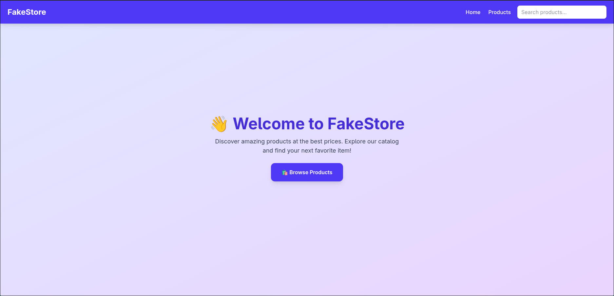
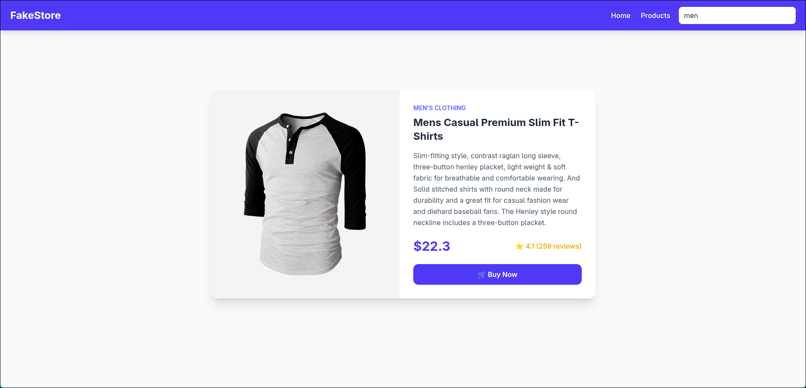

# FakeStore React App

A visually appealing React e-commerce app that displays products from FakeStore API with dynamic search functionality and individual product details.

## Features

* Homepage with welcome message and navigation links.
* Products page listing all products.
* Product detail page

## Installation 

1. Clone the repository

```
git clone https://github.com/AvesekShrestha/gritfeat
cd react/day2
```

2. Install dependencies

```
npm install
```

3. Run the app

```
npm run dev
```

4. Open broswer with http://localhost:5173

# Glimpse





