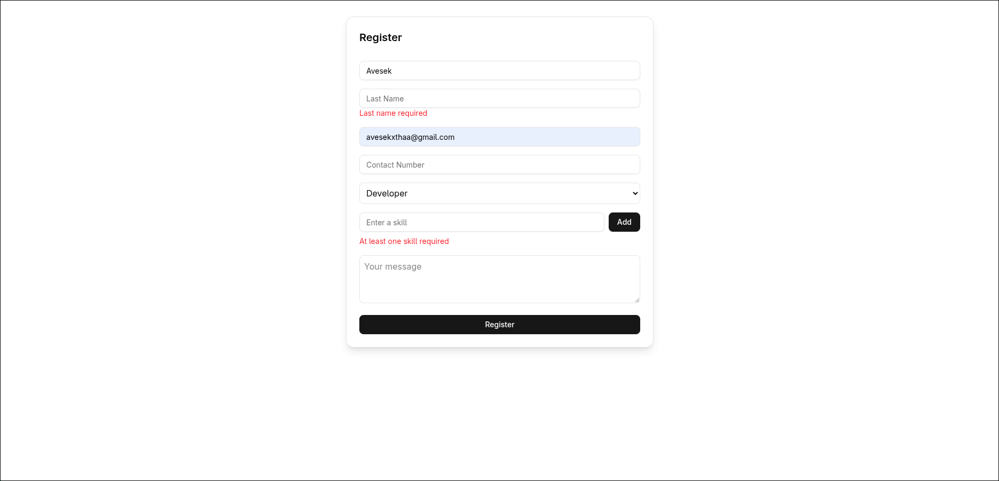

# User Registration & Profile Dashboard

## Installation 

1. Clone the repo

```
git clone https://github.com/AvesekShrestha/gritfeat
cd react/day3
```

2. Install dependencies

```
npm install
```

3. Run the project 

```
npm run dev
```

4. Visit at http://localhost:5173 

## Glimps 



